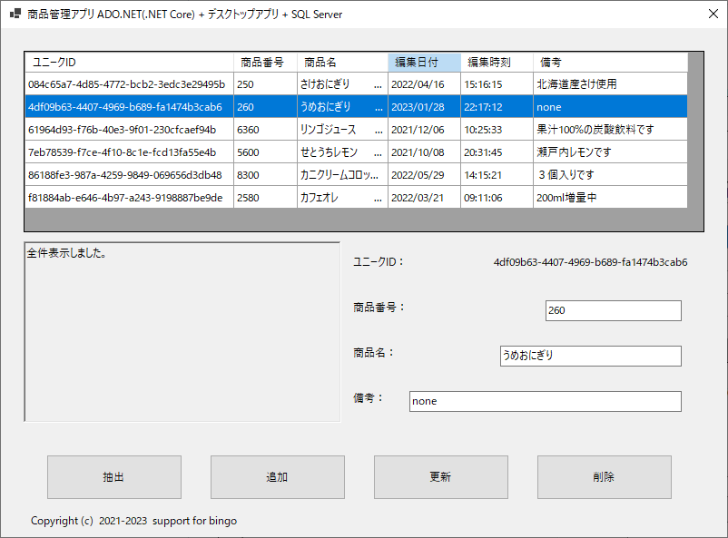

## :computer: Windows Formsで.NET Data Providerを使いSQLServerとの読み書きサンプル  
___
## 開発環境
```
統合開発環境：Microsoft Visual Studio 2022 Community Edition 17.4.5  
言語：C# 10.0  
デスクトップ：Windows Formsアプリケーション
フレームワーク：.NET 6.0.14  
開発SDK：.NET SDK 6.0.406  
データベース：Microsoft SQLServer 2022 Express CU1  
-データベース管理ツール：Microsoft SQL Server Management Studio 19.0.1
データベース接続：.NET Framework Data Provider for SQL Server  
NuGetパッケージ：Install-Package Microsoft.Data.SqlClient -Version 5.1.0  
```

  

## 事前準備  
### サンプルプログラムを実行する際のデータベース作成  
Microsoft SQL Server Management Studioのクエリーで以下を実行するかこれ相当をデザイナで作成します。  

**データベース作成(Microsoft SQL Server ManagementStudioでのデフォルト相当)**  
※Microsoft SQL Server 2022 Express Editionで名前付きインスタンスがSQLEXPRESSの場合のクエリーです。  
別のインスタンス名やSQL Server 2019などのバージョンの場合はPathのMSSQL16.SQLEXPRESS(ディレクトリ名)  
の数字が違いますのでご自身のディレクトリ名に合わせて下さい。  

```
use [master]
CREATE DATABASE AdoNetSample
ON
(NAME=AdoNetSample,FILENAME='C:\Program Files\Microsoft SQL Server\MSSQL16.SQLEXPRESS\MSSQL\DATA\AdoNetSample.mdf',SIZE=8MB,FILEGROWTH=64MB)
LOG ON
(NAME=AdoNetSample_log,FILENAME='C:\Program Files\Microsoft SQL Server\MSSQL16.SQLEXPRESS\MSSQL\DATA\AdoNetSample_log.ldf',SIZE=8MB,FILEGROWTH=64MB)
	
ALTER DATABASE AdoNetSample SET AUTO_CLOSE OFF
```

**テーブル作成**  
```
use [master]
create table [AdoNetSample].[dbo].[shohins] (
	unique_id char(36) NOT NULL,        /*ユニークID*/
	shohin_code int NOT NULL,           /*商品番号*/
	shohin_name char(50),				/*商品名*/
	updated_on decimal(8,0) NOT NULL,   /*編集日付*/
	updated_at decimal(6,0) NOT NULL,   /*編集時刻*/
	remarks varchar(255),               /*備考*/
	primary key (unique_id))
```

**サンプルデータ追加**  
```
use [master]
insert into [AdoNetSample].[dbo].[shohins]
	(unique_id, shohin_code, shohin_name, updated_on, updated_at, remarks) values
	(lower(convert(char(36), newid())), 5600,'せとうちレモン',20211008,203145,'瀬戸内レモンです')
insert into [AdoNetSample].[dbo].[shohins]
	(unique_id, shohin_code, shohin_name, updated_on, updated_at, remarks) values
	(lower(convert(char(36), newid())), 6360,'リンゴジュース',20211206,102533,'果汁100%の炭酸飲料です')
insert into [AdoNetSample].[dbo].[shohins]
	(unique_id, shohin_code, shohin_name, updated_on, updated_at, remarks) values
	(lower(convert(char(36), newid())), 2580,'カフェオレ',20220321,91106,'200ml増量中')
insert into [AdoNetSample].[dbo].[shohins]
	(unique_id, shohin_code, shohin_name, updated_on, updated_at, remarks) values
	(lower(convert(char(36), newid())), 250,'さけおにぎり',20220416,151615,'北海道産さけ使用')
insert into [AdoNetSample].[dbo].[shohins]
	(unique_id, shohin_code, shohin_name, updated_on, updated_at, remarks) values
	(lower(convert(char(36), newid())), 260,'うめおにぎり',20220513,111506,'none')
insert into [AdoNetSample].[dbo].[shohins]
	(unique_id, shohin_code, shohin_name, updated_on, updated_at, remarks) values
	(lower(convert(char(36), newid())), 8300,'カニクリームコロッケ',20220529,141521,'３個入りです')
```

___